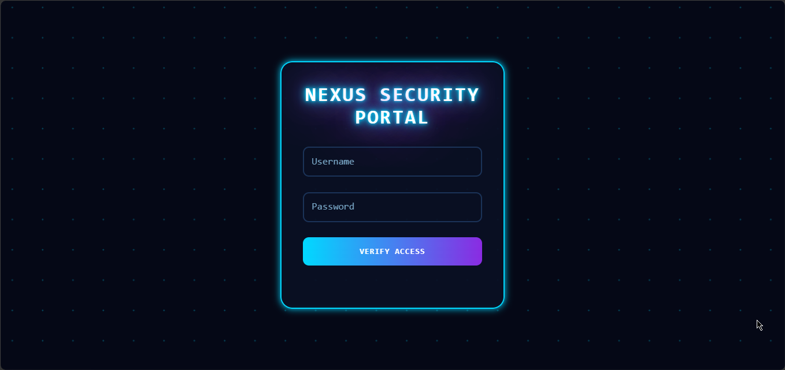

# ⚡ Nexus Cyberpunk Screen

A futuristic cyberpunk-style animated interface built using pure HTML, CSS, and JavaScript. This project combines neon glow effects, animated scan lines, floating particle backgrounds, and interactive UI elements to create an immersive sci-fi screen experience.

## 📸 Preview



## ✨ Features

* Cyberpunk Neon Interface
* Animated Scan Line Effect
* Floating Particle Background
* Interactive Status System
* Neon Glow Visual Effects
* Futuristic HUD Styling
* Responsive Layout
* Pure HTML, CSS & JavaScript

## 🛠️ Built With

* HTML5
* CSS3
* JavaScript

## 📂 Project Structure

```text
Nexus-Cyberpunk-Screen/
│
├── index.html
├── preview.png
└── README.md
```

## 🚀 Getting Started

### Clone the Repository

```bash
git clone https://github.com/Jeremykoresh/Nexus-Cyberpunk-Screen.git-
```

### Open the Project

Simply open the `index.html` file in your preferred web browser.

No installation or external dependencies are required.

## 🎨 Customization

You can easily customize:

* Neon color schemes
* Glow effects
* Scan line animation
* Verification messages
* Particle background
* Typography
* Interface styling
* Animation speed

## 💡 Learning Objectives

This project is suitable for developers who want to learn:

* CSS Animations
* Cyberpunk UI Design
* Neon Effects with CSS
* Responsive Frontend Development
* JavaScript Interactions
* Futuristic Screen Design

## 📱 Responsive Design

The interface is designed to work across desktop, tablet, and mobile devices.

## ⭐ Support

If you found this project helpful, consider giving it a star on GitHub.

## 👨‍💻 Author

Jeremy Koresh

GitHub: https://github.com/Jeremykoresh

## 📄 License

This project is available for educational and personal learning purposes.
